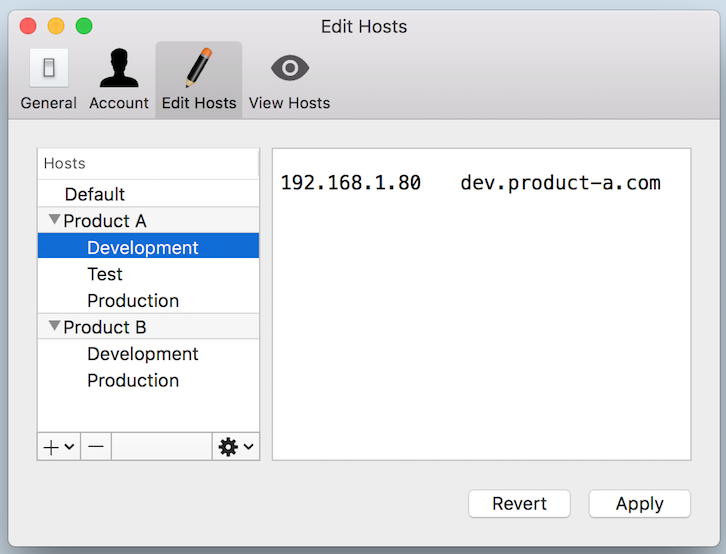
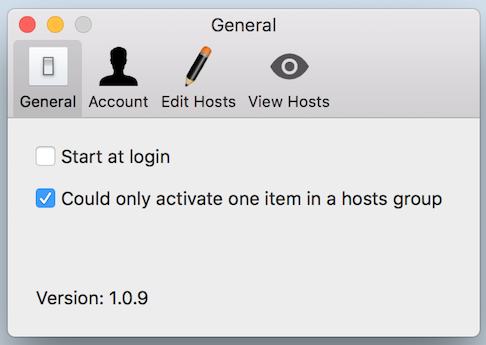
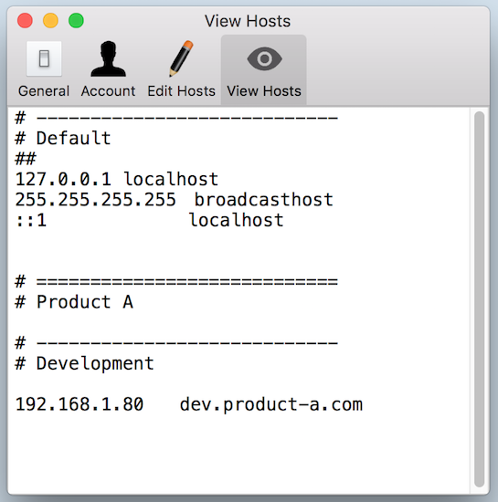
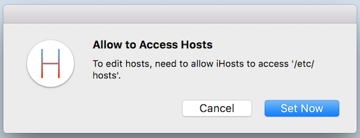
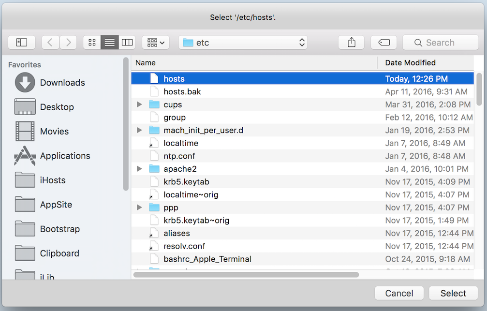
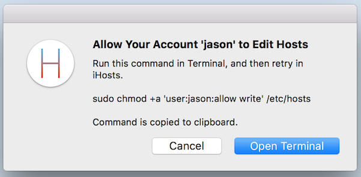
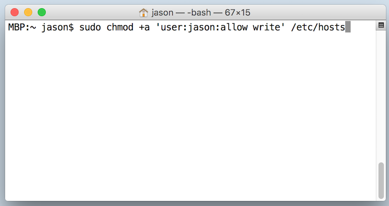
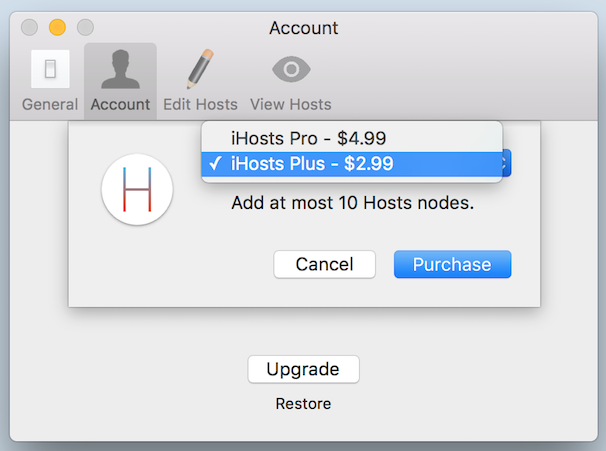
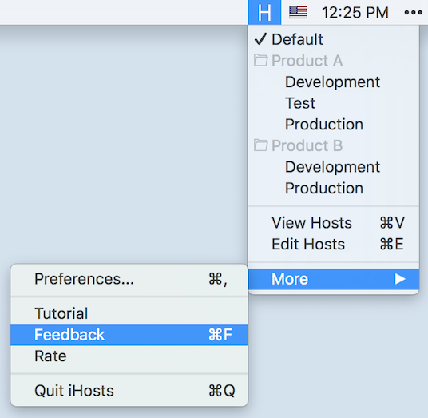

# What's iHosts?

iHosts is perfect for editing /etc/hosts on Mac OS X.

> Do I need iHosts?

If you need to edit /etc/hosts, or you even have already used some tools do it, you really need to try iHosts for free. Now iHosts supports Mac OS X.

[>>> Click to Download iHosts from Mac App Store for Free <<<](https://itunes.apple.com/app/id1102004240?ls=1&mt=12)

# Edit Hosts

To manage Hosts, start from edting Hosts.

Click iHosts's icon in system menu bar. Then select '**Edit Hosts**' or directly press the shortcut of  '**Command + E**', you can open the 'Edit Hosts' window.

In 'Edit Hosts' window, you could:

- Edit Hosts like editing normal plain text file.
- Add or remove hosts or hosts group. Operating Hosts node include editing, moving up, moving down, etc.
- Just like the native Mac OS X, you can click 'Apply' or 'Revert' to save or revert editing.

Tips to edit Hosts:

- Comments start with '#'.
- For each Hosts record, IP address is in the beginning, followed by domain. You can use any space or tab to separate them. Suggest using tab, as if so the domain could keep align left.

## Using Groups

Using groups to manage Hosts is one of iHosts's key features. Normal Hosts management tool replace the entire Hosts file. But iHosts could only update part of them. Group is the key part to implement it.

> What's the benefit to manage Hosts using groups?

- Put unrelated Hosts nodes in different groups. This could make the nodes more clear.
- Put related Hosts node in one group. This could enable the feature of 'Could only activate one item in a hosts group'.

For example, if you need to develop both 'Product A' and 'Product B'. Each product has different 'Devlopemnt', 'Test' and 'Online' envirements. It's very suitable to use groups. You can create two groups of 'Product A' and 'Product B', put related Hosts record to its Hosts node and put thest nodes to related groups.

# Switch Hosts

Click iHosts's icon in system menu bar. Then select or unselect any Hosts node to enable or disable related Hosts record.

When a Hosts menu item is selected, there's '✓' in front of it.

## Could only activate one item in a hosts group

By default you will find, when you select one Hosts menu item, then other menu items in this group will be automatically unselected. This is the feature of 'Could only activate one item in a hosts group'.

> When to use this feature?

For example, if you need to switch between development environment (e.g., 192.168.1.80) and test environment (e.g., 192.168.1.88), you could:

- Add a new group in iHosts.
- Add 'Development' Hosts node, add record of '192.168.1.80 mydomain.com'
- Add 'Test' Hosts node, add record of '192.168.1.88 mydomain.com'

Then during development you can keep using same domain of 'mydomain.com', and switch between development and test environment.

If you don't need this feature, you can also disable it in 'Preferences... > General'.

## View Hosts in Real Time

When editing Hosts or during development, it's possible you want to view the content of /etc/hosts. Then you need the feature to view Hosts in real time.

Click iHosts's icon in system menu bar. Then select '**View Hosts' or directly press the shortcut of  '**Command + V**', you can open the 'View Hosts' window.

## Sandbox and Permission

For security reason and to release on Mac App Store, iHosts runs in Sandbox mode. It means by default iHosts can't access any file out of Sandbox. Thus to edit Hosts, you need to manually allow iHosts to access the /etc/hosts file.

And by default current user can't edit the /etc/hosts file. Then when switching Hosts for the first time, you need to open Terminal to allow current user to edit /etc/hosts file by running a command.

These steps seems complex, but in fact you only need to do it for one time. And then you can freely editing or switching Hosts. In another time, it brings more security for you, as iHosts never runs in Administrator mode, thus it means iHosts is always safe or you. So these settings are worth.

## /etc/hosts Updating Policy

iHosts will update /etc/hosts file at these time:

- 'Apply' when editing Hosts.
- Switch Hosts node in system menu.
- Exit iHosts and restart.

# Else

## Account and Limits

You can use iHosts for free, but could add at most 4 nodes. You can upgrade to advanced account to add more in 'Preferences... > Account'.

- Upgrade to iHosts Plus, add at most 10 Hosts nodes.
- Upgrade to iHosts Pro, add at most 50 Hosts nodes.

You can choose iHosts Plus or iHosts Pro based on your requirement.

Of course, if you think iHosts is good, and willing to support iHosts to keep on improving, you can also support iHosts by upgrading to advanced account. Thanks in advance.

## Settings

If you need to let iHosts start when boot, you can enable it in 'Preferences... > General'.

## Feedback

If you have any problem or suggestion for iHosts, welcome to contact us using following ways.

- In iHosts's menu, click 'More > Feedback', or press shortcut of '**Command + F**', then you can feedback in Github.
  - Or you can directly open [https://github.com/toolinbox/iHosts/issues/new](https://github.com/toolinbox/iHosts/issues/new)

- Keep on pressing '**Alt**' key, open iHosts's menu, click 'More > Feedback by Email', or press shortcut of '**Alt + Command + F**', then you can feedback by email.
  - You can also directly send email to [iToolinbox+ihosts@gmail.com](mailto:iToolinbox+ihosts@gmail.com)
- In iHosts's menu, click 'More > Rate', you can open iHosts in Mac App Store. Then rate iHosts or leave your comments.

Look forward to your feedback.
